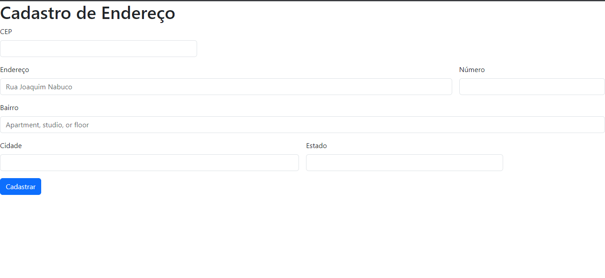

# 🚀Sejam Todos Bem vindos Ao Meu Repositorio
   - [Formulario de Endereço](#projeto---formulario-de-endere%C3%A7o)  
   - [Descrição](#descri%C3%A7%C3%A3o)  
   - [Introdução](#introdu%C3%A7%C3%A3o)  
   - [Funcionalidades](#funcionalidades)  
   - [Tecnologias Utilizadas](#tecnologias-utilizadas)  
   - [Fontes Consultadas](#fontes-consultadas)  
   - [Autores](#autores)  

# Projeto - Formulario de Endereço📫

   
## Descrição📝
Este repositório contém um projeto de formulário de cadastro de endereço desenvolvido com Bootstrap 5 O formulário é integrado com um serviço de consulta de CEP, o que permite o preenchimento automático das informações do endereço quando um CEP válido é inserido.

## Funcionalidades⚙️
1-quando digitamos o cep correto ele preenche automaticamente as informações
 

2-quando digitamos o CEP errado ou deixamos o campo vazio ele da o aviso de que o CEP está incorreto.
 

### Tecnologias Utilizadas🌐
°HTML5    
°CCS3
°JAVA-SCRIPT3       
°BOOTSTRAP-5   
## Fontes Consultadas📌
[Bootstrap](https://getbootstrap.com/)     
[alura](https://www.alura.com.br/artigos/escrever-bom-readme)       
[répositorio github](https://gist.github.com/lohhans/f8da0b147550df3f96914d3797e9fb89)    

## Autores🧑🏿‍💻
[Leonardo de Oliveira](https://github.com/leoOliveiraBR)
